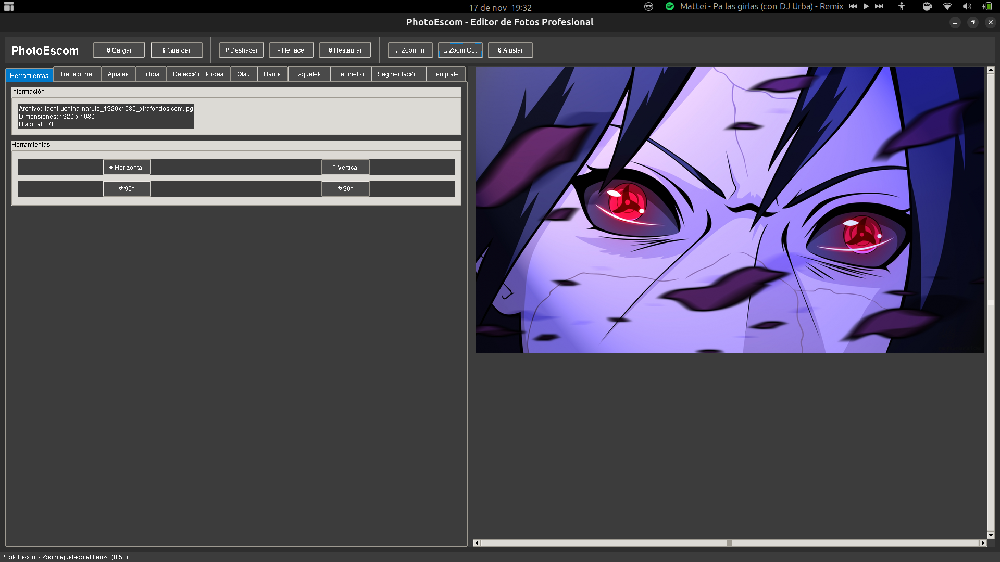

# 📸 PhotoEscom - Editor de Fotos para Visión Artificial

[](https://www.python.org/)
[](https://pypi.org/)

**PhotoEscom** es un editor de fotos funcional construido con Python y Tkinter. Fue desarrollado como un proyecto para el curso de **Visión Artificial**.

Además de las herramientas de edición estándar (rotar, ajustar brillo, filtros), su característica principal es un módulo avanzado para la **detección de bordes**, que implementa fielmente los algoritmos teóricos vistos en clase (basados en las secciones 6.3 de la bibliografía).

## 🖼️ Vistazo a la Interfaz

*(Te recomiendo encarecidamente tomar un screenshot de tu aplicación y ponerla aquí. Hará que tu repositorio se vea 100 veces más profesional. Nombra el screenshot `demo.png` y súbelo al repositorio)*



## ✨ Características Principales

### Edición Básica
* **Cargar y Guardar** imágenes en múltiples formatos (JPG, PNG, BMP, etc.).
* **Historial de cambios** con funciones de Deshacer (Undo) y Rehacer (Redo).
* **Zoom** y paneo (scroll) en el lienzo.
* **Transformaciones:** Rotación (con slider), volteo horizontal y vertical, y escalado.
* **Filtros (PIL):** Desenfoque, detalle, realce de bordes, etc.
* **Ajustes de Imagen:** Brillo, contraste, saturación y nitidez.

### 🧠 Módulo de Visión Artificial: Detección de Bordes

Esta es la característica central del proyecto. Implementa una amplia gama de operadores de detección de bordes, permitiendo al usuario experimentar y comparar sus resultados en tiempo real.

#### Operadores de Primera Derivada
* **Gradiente Básico** (Diferencias finitas)
* **Operador de Sobel** (con máscaras extensibles de 3x3, 5x5, 7x7, 9x9 y 11x11)
* **Operador de Prewitt**
* **Operador de Roberts** (con ambas formas: $\sqrt{D_1^2 + D_2^2}$ y $|D_1| + |D_2|$)

#### Operadores de Brújula (Compass)
* **Operador de Kirsch** (8 direcciones)
* **Operador de Robinson** (8 direcciones)

#### Operadores de Base Vectorial
* **Operador de Frei-Chen** (utilizando el subespacio de 9 máscaras)

#### Operadores de Segunda Derivada
* **Laplaciano de la Gaussiana (LoG)** con detección de cruce por cero.

#### Algoritmo Óptimo
* **Operador de Canny:** Implementación completa con suavizado Gaussiano, supresión no máxima e histéresis de doble umbral.

## ⚙️ Dependencias

Este proyecto utiliza las siguientes bibliotecas de Python:

* **Tkinter** (para la interfaz gráfica, usualmente incluido en Python)
* **Pillow (PIL)** (para manipulación de imágenes)
* **NumPy** (para cómputo numérico y manejo de matrices)
* **SciPy** (para operaciones de convolución y filtros)
* **OpenCV-Python** (para el suavizado Gaussiano y la implementación de Canny)

Puedes instalarlas usando `pip`:

```bash
pip install numpy pillow scipy opencv-python
```

## 🚀 Cómo Ejecutar

1.  Clona o descarga este repositorio.
2.  Asegúrate de tener todas las dependencias instaladas.
3.  Ejecuta el script de Python:

```bash
python tu_archivo.py
```
*(Reemplaza `tu_archivo.py` con el nombre que le hayas dado al script)*